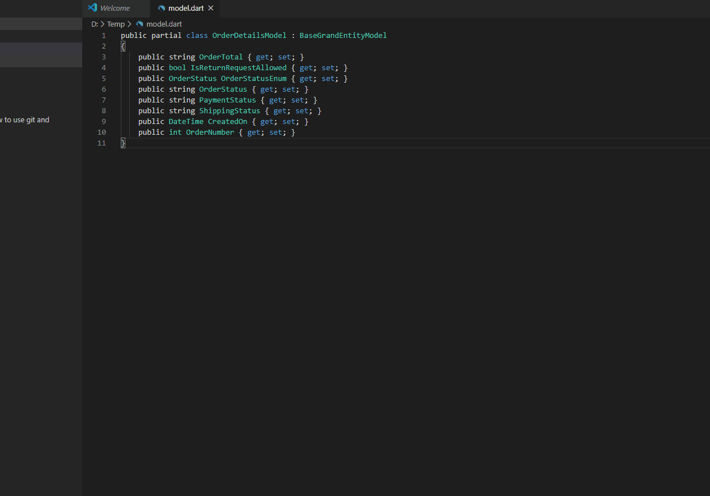

# cs-poco-to-dart README

This extension provides command to quickly convert C# poco class to Dart model class with JsonSerializer support syntax

## Features

### Convert C# poco class to Dart model class. Add support Json serializer to Dart model class

## Release Notes

### 0.0.1

First version with 2 editor commands *CSharp to Dart code* and *CSharp to Dart code generate json serializer*

### 0.0.2

Update readme